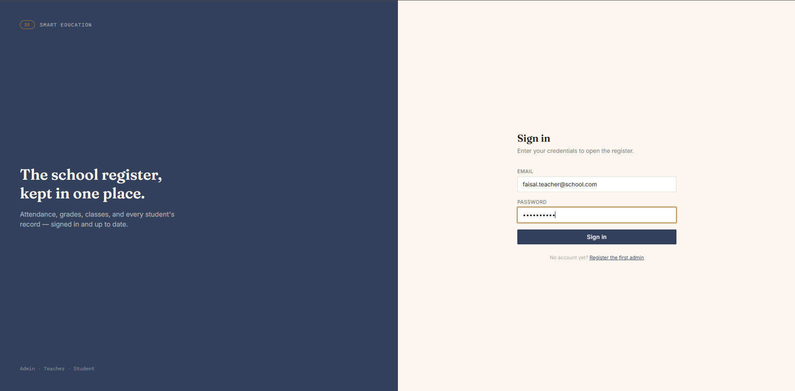
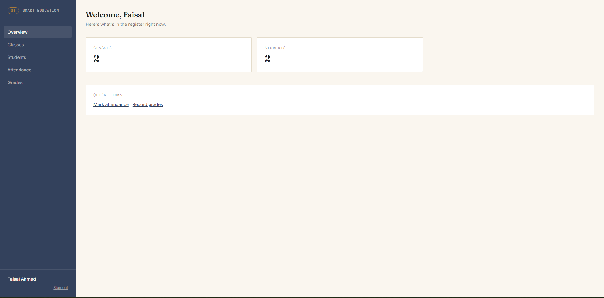
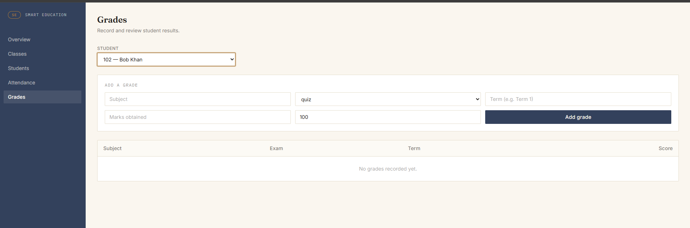

# Smart Education

A school management system — students, classes, attendance, and grades,
with role-based access for admins, teachers, and students.

Built as a full-stack project: a NestJS + PostgreSQL API and a Next.js
dashboard that talks to it.



*Sign-in screen, styled like a school ledger — sections for admin, teacher, and student access.*

## Features

- **Auth** — JWT-based login, roles: `admin`, `teacher`, `student`
- **Users** — admins create and manage teacher/student accounts
- **Classes** — sections, academic years, assigned class teacher
- **Students** — profiles linked to a class, optionally linked to a login
- **Attendance** — bulk mark a whole class for a date in one action;
  re-marking the same date overwrites instead of duplicating
- **Grades** — recorded per subject/exam/term; students can only see their
  own

## Stack

| Layer | Tech |
|---|---|
| Backend | NestJS, TypeORM, PostgreSQL, Passport JWT |
| Frontend | Next.js 14 (App Router), React, Tailwind CSS |
| Auth | JWT, bcrypt-hashed passwords, route-level role guards |

## Project structure

```
smart_education/
├── smart-education-backend/    NestJS API (see its own README for full API docs)
└── smart-education-frontend/   Next.js dashboard (see its own README for page-by-page docs)
```

## Running it locally

You need both halves running at once — the frontend expects the backend to
already be up.

### 1. Backend

```bash
cd smart-education-backend
npm install
cp .env.example .env   # then fill in your Postgres credentials + a JWT secret
npm run start:dev
```

Make sure PostgreSQL is running and the database in `.env` (`DB_NAME`)
already exists, e.g.:
```bash
createdb smart_education
```

The API runs at `http://localhost:3000/api` by default.

### 2. Frontend

In a separate terminal:
```bash
cd smart-education-frontend
npm install
cp .env.example .env.local
npm run dev
```

Visit whatever port it prints (usually `http://localhost:3001`, since
3000 is already taken by the backend).

### 3. Create your first account

There's no seeded admin — the first one is created through the app:

1. Go to `/register` on the frontend and create the first admin account.
2. Log in, then use the **Users** page to create teacher and student
   accounts (don't use `/register` for these — that route is only meant
   for bootstrapping the first admin).
3. Create a class under **Classes**, then add students under **Students**
   and assign them to it.
4. Use **Attendance** and **Grades** as an admin or teacher to try marking
   a roster and recording a grade.

## Roles at a glance

| Role | Can do |
|---|---|
| **admin** | everything — manage users, classes, students, attendance, grades |
| **teacher** | mark attendance, record grades, view classes/students |
| **student** | view their own attendance and grades only |

## Screenshots

| | |
|---|---|
|  |  |
| Role-aware dashboard overview | Marking attendance for a class |
|  | |
| Recording and reviewing grades | |

## Where things stand

This covers a working v1 of both halves — real auth, real roles, real
relational data, tested end to end (see the Postman collection in the
backend folder). Known gaps, if you want to keep building:

- Backend still uses `synchronize: true` for the database schema (fine for
  development; switch to TypeORM migrations before there's real data you
  can't afford to lose — see the backend README for how)
- No pagination on list views yet — fine at school scale, worth adding if
  data grows
- No automated tests — everything's been verified manually so far
- Not yet deployed — backend and frontend are meant to be deployed
  separately (e.g. Railway/Render for the backend + Postgres, Vercel for
  the frontend)

## Docs

- [`smart-education-backend/README.md`](./smart-education-backend/README.md) — full API reference, example requests, setup details
- [`smart-education-frontend/README.md`](./smart-education-frontend/README.md) — page-by-page breakdown, design notes, auth flow
